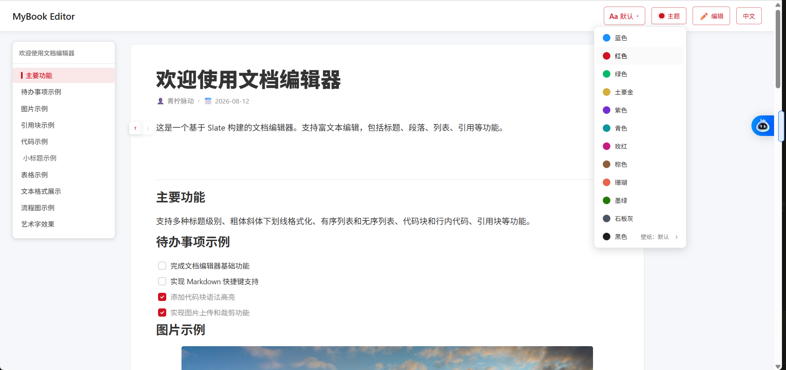
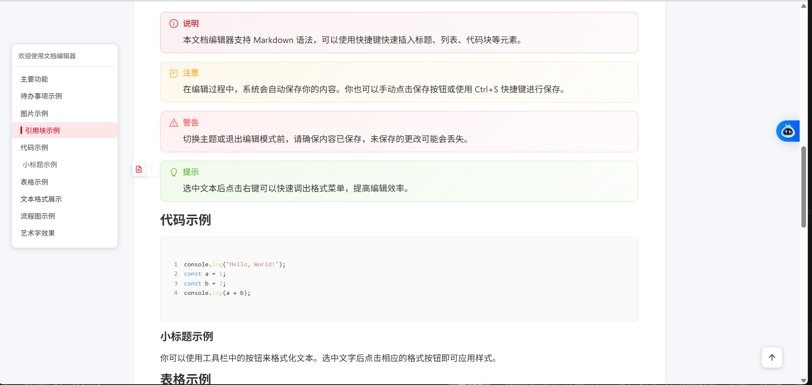
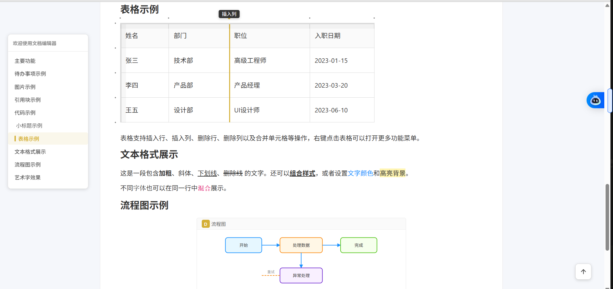

# MyBook Editor

基于 Slate 的文档编辑器（React + Slate + Antd + TypeScript + Vite）

支持富文本编辑：标题、段落、列表、引用、代码块、表格、图片、流程图、艺术字等，支持明暗主题与主题色切换。

## 界面预览

### 主界面与主题切换



### 引用块与代码示例



### 暗色主题与图片编辑


### 表格、文本格式与流程图



## 快速开始

```
pnpm i
pnpm dev
```
